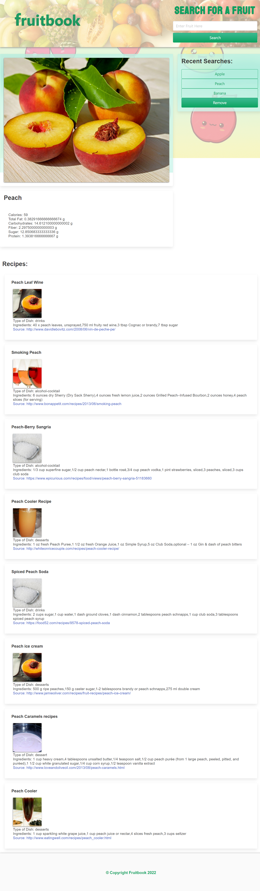

# Fruitbook

## Description

Do you have fruit lying around? Is it about to go bad? We have the perfect website for you...

Enter Fruitbook: Input the name of a fruit and you will be presented with not only all the best nutritional information for that fruit, but you will also be shown the top eight coolest recipes the internet has to offer (along with a link to find out more information about that recipe)! You'll also be shown a picture of what your fruit looks like. The app runs entirely in the browser, and can be viewed anywhere online. It also uses the CSS framework 'Bulma' for a displaying a modern UI. It uses three server side APIs - one for retrieving a picture, one for nutritional information, and one for recipes. Finally, the app uses client side storage to keep a list of most recently visited fruits

Link to the deployed website: https://emilyreddy.github.io/fruitbook/

## Installation

The repo contains an index.html file, and assets folder containing a CSS file sytlesheet, an image folder, and a javascript folder. These files were deployed at the above-mentioned link using GitHub Pages. The repo can also be cloned to a local machine and the index.html file can be opened in any web browser or IDE of choice.

## Usage

Using any desktop browser, open the above-mentioned link to view the webpage.

## Credits

Collaborators include the instructor, TAs, and fellow classmates of the UCF Coding Bootcamp (Spring 2022).

## License

Copyright (c) 2022 Fruitbook

Permission is hereby granted, free of charge, to any person obtaining a copy of this software and associated documentation files (the "Software"), to deal
in the Software without restriction, including without limitation the rights to use, copy, modify, merge, publish, distribute, sublicense, and/or sell copies of the Software, and to permit persons to whom the Software is furnished to do so, subject to the following conditions:

The above copyright notice and this permission notice shall be included in all copies or substantial portions of the Software.

THE SOFTWARE IS PROVIDED "AS IS", WITHOUT WARRANTY OF ANY KIND, EXPRESS OR IMPLIED, INCLUDING BUT NOT LIMITED TO THE WARRANTIES OF MERCHANTABILITY,
FITNESS FOR A PARTICULAR PURPOSE AND NONINFRINGEMENT. IN NO EVENT SHALL THE AUTHORS OR COPYRIGHT HOLDERS BE LIABLE FOR ANY CLAIM, DAMAGES OR OTHER LIABILITY, WHETHER IN AN ACTION OF CONTRACT, TORT OR OTHERWISE, ARISING FROM, OUT OF OR IN CONNECTION WITH THE SOFTWARE OR THE USE OR OTHER DEALINGS IN THE SOFTWARE.

## Badges

